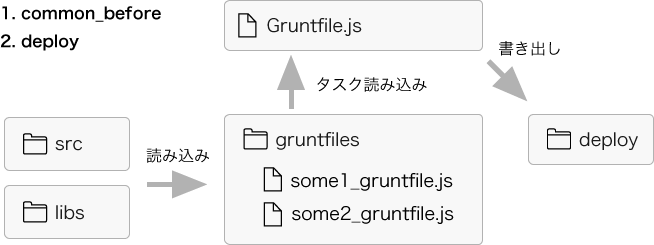
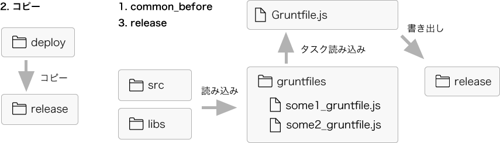

# grunt-share

 
## About
* Web制作でGruntを使用する際、複数人で共同作業をしやすくするためのテンプレートです。 
* Gruntfileを複数作成できます。
  [Gruntで快適な環境を整備したい！【インストール編】](http://www.riaxdnp.jp/?p=4659)  
  [Gruntで快適な環境を整備したい！【タスク記述編】](http://www.riaxdnp.jp/?p=4736)  
* 複数のGruntfileを自動的に読み込み共通タスクとして実行します。
* 共通タスクは、開発用書き出し、リリース用書き出しの２種類あります。
* 共通タスクとは別に通常のgruntタスクを独自に登録することもできます。
* Gitの利用を前提にしています。
* Gitのルートに本テンプレートを展開してください。 

## Sample

## Setup

1. [Node.jsをインストール](http://nodejs.jp/nodejs.org_ja/docs/v0.10/)
1. `sudo npm install -g yo grunt-cli bower`
1.   プロジェクトテンプレートをダウンロード
`sudo npm install https://github.com/dummy/generator-grunt-share -g`

2. プロジェクトテンプレートをインストール
`cd インストールしたいディレクトリ`  
`yo grunt-share`

## Gruntfiles
`Gruntfile.js`は基本的に直接編集せず、  
`/gruntfiles`にある`template_grunt.js`をコピペして好きな名前にリネームし、
自分専用のgruntfileとします。

通常の`Gruntfile.js`の基本構成は以下のようになりますが、  
  [（参考）Gruntで快適な環境を整備したい！【タスク記述編】](http://www.riaxdnp.jp/?p=4736)  

    　module.exports = function(grunt){
    　
    　　　’use strict’;
    　
    　　　grunt.initConfig({
    　　　　　// package.jsonに設定されている内容を取得
    　　　　　// バージョンや名称などの情報を外部ファイルで共通化できる
    　　　　　pkg: grunt.file.readJSON(“package.json”),
    　
    　　　　　//　タスクの設定
    　　　　　タスク名:{
    　　　　　　　//　タスクの対象となるファイルのパスや出力先等の設定
    　　　　　}
    　　　});
    　
    　　　//　プラグインの読み込み
    　　　grunt.loadNpmTasks(“使用するプラグイン名”);
    　
    　　　//　タスクに名前をつける
    　　　//　”default” はgruntコマンドを入力した際に行うデフォルトのタスク
    　　　grunt.registerTask(“default”, ["タスク名"]);
    　
    　};  
  
  本テンプレート`/gruntfiles/`のgruntfileはこうなります。

    　module.exports.extendGrantTask = function(grunt){
    　
    　　　’use strict’;
    　
    　　　grunt.extendConfig({

    　　　　　//　タスクの設定
    　　　　　タスク名:{
    　　　　　　　//　タスクの対象となるファイルのパスや出力先等の設定
    　　　　　}
    　　　});
    　
    　　　//　プラグインの読み込み
    　　　grunt.loadNpmTasks(“使用するプラグイン名”);
    　
    　　　//　共有タスクを登録する
    　　　return {
    　　　　"common_before"   : ["タスク名"],
    　　　　"deploy"      : ["タスク名"],
    　　　　"release"       : ["タスク名"]
    　　　};
    　
    　};  
gruntのチュートリアルサイトなどをみる時は以下を置き換えて考えてください。  
  
* `module.exports` → `module.exports.extendGrantTask`  
* `grunt.initConfig` → `grunt.extendConfig`  
* `grunt.registerTask`→ `return {}`  
  

returnオブジェクトで以下タスク配列を記述することで共有タスクとして登録されます  
  
* **`common_before`**  
`deploy`、`release`それぞれの前に（`release`の場合コピー前に）実行される共通タスク  
* **`deploy`**  
`deploy`ビルド専用タスク  
* **`release`**  
`release`ビルド専用タスク  

共有のため必ず任意のサブタスク名をつけるようにしてください。  
_NG_  

    uglify: {
    　　　　src: [“src/js/hoge1.js“, “src/js/hoge2.js“]
    　　　　dest: “deploy/js/hoge.min.js”
    　　　},
    　　　
`['copy','concat','uglify']`  

_OK_  

    uglify: {
    　　　　　　hoge: {
    　　　　　　　　　src: [“src/js/hoge1.js“, “src/js/hoge2.js“]
    　　　　　　　　　dest: “deploy/js/hoge.min.js”
    　　　　　　}
    　　　},
    　　　
`['copy:hoge','concat:hoge']`  

***
`grunt-contrib-〜`  
で始まるプラグインはテンプレートに初めから組み込まれているので  
`grunt.loadNpmTasks`を呼ぶ必要はありません。

それ以外は基本的に通常の`Gruntfile.js`と同じように使えます。  
とりあえず個人個人で色々と試してみるべきではないかと思います。

## Directory構成

    /
    |-- .gitignore
    |-- package.json - 設定。devDependencyを基にnode_modulesに依存ファイルをインストールします
    |-- node_modules - grunt含め外部nodeモジュールファイルの格納場所
    |-- release - リリース(release)ビルドの書き出し先
    |-- README.md - 本ドキュメント
    |-- Gruntfile.js - gruntfiles内のファイルを読み込みまとめて制御する。共有タスクを追記する。
    |-- libs - ライブラリなど
    |-- src - コンパイルが必要な言語、結合前JSなど
    |-- deploy - 開発（deploy）ビルドの書き出し先
    `-- gruntfiles - 個々別々のgruntfile置き場
        `-- template_grunt.js - 個人用gruntfileテンプレート。コピーして使う

## ビルド  

### deploy版（開発版）書き出し  
* ターミナル `cd プロジェクトディレクトリ` + `grunt deploy`  
* プロジェクトディレクトリ選択 +  
【コンテキストメニューコマンド】`Gruntーdeploy版を書き出し`  
***
実行順序  
  
1. `common_before `タスク（deploy、release共通）

   
 
2. `deploy`タスク   

 

***

### release版（リリース版）書き出し  
* ターミナル `cd プロジェクトディレクトリ` + `grunt release`  
* プロジェクトディレクトリ選択 +  
【コンテキストメニューコマンド】`Gruntーrelease版を書き出し`  
***
実行順序  

1. `common_before `タスク（deploy、release共通）

 

1. `copy`タスク（全ファイルをdeploy→releaseにコピー）

 

1. `release`タスク

 

### 自分のgruntfileだけビルドしたい  
拡張子除くgruntファイル名を引数に渡す  
`grunt deploy:your_gruntfile_name`  
`grunt release:your_gruntfile_name`  

## Git連携
### .gitignore  
gitignoreファイルは記述したファイルをgitの管理から除外するGit設定ファイルです。  
以下のように指定しています。  

    .*
    components/
    bower.json
    node_modules/
    release/
    !.gitignore

`node_modules/`が除外されているため、初めにgitからデータを取ってきた時には
依存ファイルをインストールする必要があります。（package.jsonのdevDependenciesを基にnode_modules/にインストールされます）  
インストールしたいディレクトリを選択して  
【コンテキストメニューコマンド】  
`Grunt-依存ファイルをインストール`  
または、ターミナルを開いて  
`cd インストールしたいディレクトリ`  
`grunt install`  

`package.json`の`devDependencies`を基に`node_modules/`にインストールされます。

## Tips
### 直書きはどこでするか？
deploy フォルダで。

### 独自にnode_modulesに追加したいモジュールがある
ターミナル`grunt install 追加したいモジュール -save-dev`  
後ろに`-save-dev`をつけると`package.json`の`devDependencies`にモジュール名が記録され、
Gitを通じて共有されるので忘れないように。  

### ファイルの更新を監視して自動ビルドさせたい
`watch:サブタスク名`タスクに`deploy`  `release`を指定。  

    watch: {
    　　　　　hoge: {
    　　　　　　　　// 変更を監視するファイルを指定
    　　　　　　　　　files: ["deploy/js/"],
    　　　　　　　　　// 変更されたらどのタスクを実行するか
    　　　　　　　　　tasks: ["deploy:your_gruntfile_name"]
    　　　　　　}
    　　　},

### 開発版とリリース版で処理をわけて書くのが大変
`common_before`タスクのみを使う
